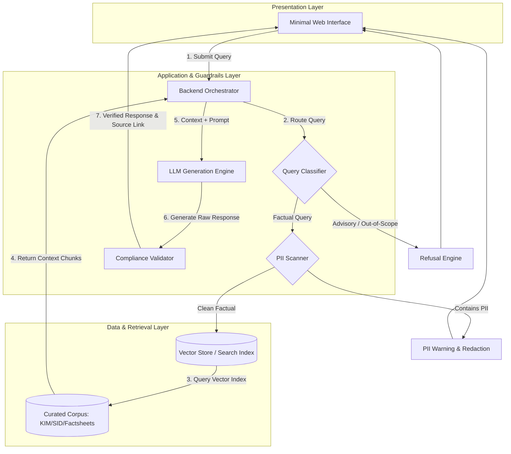
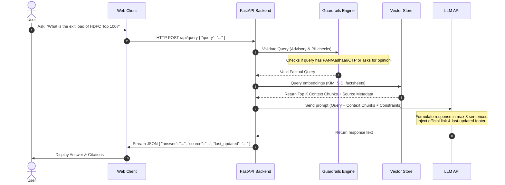
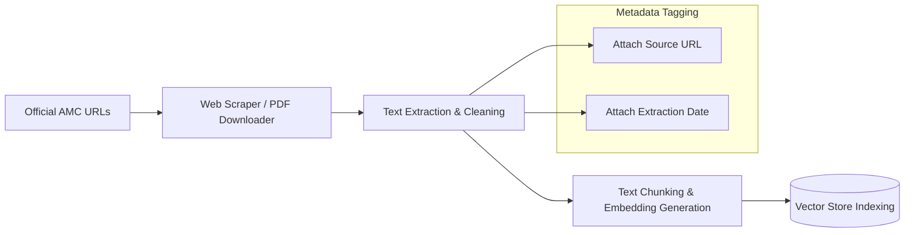

# Architecture Design: Mutual Fund FAQ Assistant

This document details the architectural layout, data flow, and components of the **Mutual Fund FAQ Assistant (Facts-Only Q&A)**. The system is designed around a lightweight, high-precision Retrieval-Augmented Generation (RAG) framework equipped with strict compliance and privacy guardrails.

---

## 1. High-Level Component Architecture

The application is structured into three primary tiers: the **User Interface (Presentation Layer)**, the **Orchestration & Guardrails Layer (Application backend)**, and the **Retrieval & Storage Layer (Data Layer)**.

---

## 2. Core Components Detail

### A. Presentation Layer (Minimal Web UI)
A simple, state-of-the-art conversational interface utilizing Vanilla HTML/CSS/JS.
- **Features**:
  - Visible global disclaimer: `"Facts-only. No investment advice."`
  - Starter questions for quick exploration.
  - Streaming conversational display.
  - Formatted citations showing active source links and the last-updated date footer.

### B. Application & Guardrails Layer
This layer operates as the control tower for inputs, routing, and processing compliance.
1. **Query Classifier**: Evaluates whether incoming prompts seek objective facts or advisory/subjective guidance.
   - *Factual Examples*: "What is the exit load of Fund X?", "Who is the fund manager of Fund Y?"
   - *Advisory Examples*: "Which fund is best for tax saving?", "Should I buy ICICI Prudential Bluechip?"
2. **PII Scanner**: Leverages deterministic rules (regex) to intercept queries containing sensitive user credentials (such as PAN, Aadhaar, folio numbers, bank accounts, or OTPs) and returns a privacy refusal message before calling downstream AI models.
3. **LLM Generation Engine**: Utilizes a highly constrained prompt system instructing the LLM to write replies strictly from the provided context.
4. **Post-Processor**: Asserts formatting constraints:
   - Output lengths are restricted to $\le 3$ sentences.
   - Verifies the inclusion of exactly one citation URL and the `Last updated` timestamp.

### C. Data & Retrieval Layer
- **Curated Corpus**: A JSON/Markdown database indexing official documents from the selected AMC (e.g. KIM, SID, Factsheets, and download page guides).
- **Search Index / Vector Database**: Contains tokenized and embedded document chunks to run semantic or keyword searches. Since the corpus is small (15–25 documents), a lightweight vector store like ChromaDB, FAISS, or even a local metadata index is used.

---

## 3. Detailed Data Flow Trace

Below is the lifecycle of a request from client input to response generation:

---

## 4. Ingestion & Pre-processing Pipeline

To prepare the retrieval index, we process the official public URLs using an offline ingestion pipeline:

- **Chunking Strategy**: Overlapping recursive character splitter (e.g. chunk size: 512 tokens, overlap: 64 tokens) to maintain search contextual accuracy across numbers, tables, and clauses in factsheets.
- **Data Cleaning & Sanitization**: Strips HTML boilerplates (such as `script`, `style`, `meta`, `header`, `footer`, `nav`, and `noscript` tags) during ingestion using BeautifulSoup. Text segments are parsed, whitespaces are normalized, and irrelevant short lines (under 30 characters) containing menu/button noise are filtered out.
- **Source Mapping**: Every chunk is tagged with its origin file name, public URL, and download timestamp to ensure citation fidelity.
- **Automated Update Scheduler**: A background scheduling daemon (which runs as a background thread started on web-server startup) triggers database refreshes every day at **09:25 AM**. It executes the scraping ingest module (`src/ingest.py`) followed by the vector builder module (`src/index_builder.py`) to keep local data files and vector embeddings synchronized with upstream changes.

---

## 5. Security & Regulatory Compliance Guardrails

As a financial tool, the assistant enforces strict boundary controls:

| Risk Area | Mitigating Guardrail Design |
|---|---|
| **Investment Advice / Opinion** | The Classifier rejects subjective terms (*"better", "should I", "recommend"*) and redirects the user with educational links. |
| **Out-of-Scope RAG Hallucinations** | If the retrieval similarity score is below a predefined threshold, the assistant falls back to a polite refusal: *"I cannot find official source documents for this request."* |
| **Privacy Leakage (PII)** | Incoming text is scanned via regex patterns for Aadhaar (`[2-9]{1}[0-9]{3}\\s[0-9]{4}\\s[0-9]{4}`), PAN (`[A-Z]{5}[0-9]{4}[A-Z]{1}`), and generic account details, stopping processing immediately if flagged. |
| **Data Recency** | The system automatically appends the database build date as the `Last updated from sources: <date>` footer, ensuring users know the age of the data. |
