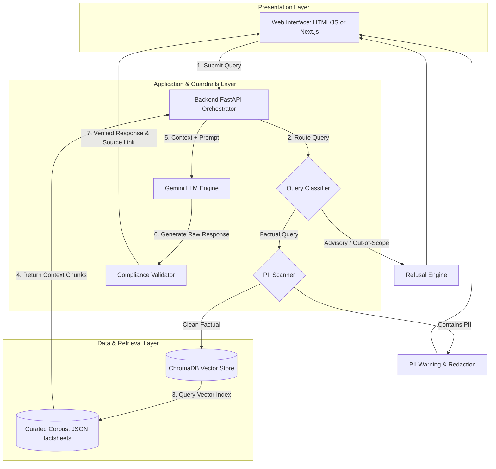

# Groww Mutual Fund FAQ Chatbot (RAG-Based Facts-Only Q&A)

A lightweight, high-precision Retrieval-Augmented Generation (RAG) conversational assistant designed for querying objective, verifiable details about mutual fund schemes. This project replicates a **Groww-like** product context, enforcing strict compliance, advisory-free guardrails, and data privacy.

---

## 🌟 Key Features

1. **Facts-Only Q&A**: Answers query details directly from official AMC data (e.g. exit loads, expense ratios, minimum SIP amounts, fund manager tenures, benchmark indexes, riskometer classifications).
2. **Strict Guardrails & Refusals**:
   - **No Investment Advice**: Automatically detects and politely blocks queries asking for comparisons, recommendations, performance predictions, or investment advice, redirecting users to SEBI/AMFI educational platforms.
   - **PII Scan**: Rejects and sanitizes inputs containing sensitive personal identifiable information (PII) such as PAN, Aadhaar, folio numbers, bank accounts, or OTPs.
   - **Out-of-Scope Fallbacks**: Gracefully declines to answer when official source documentation for the query is unavailable.
3. **Citation & Expirations**:
   - Outputs are strictly capped at a **maximum of 3 sentences**.
   - Responses always cite **exactly one official source URL**.
   - Includes a dynamic footer showing the data's last updated timestamp.
4. **Automated Background Scheduler**: Built-in background daemon that runs daily at **09:25 AM** to fetch latest factsheet updates, scrape sources, and automatically rebuild vector index databases.
5. **Double UI Options**:
   - **Vanilla Static Client**: Fully responsive and beautiful HTML/CSS/JS frontend served directly by FastAPI.
   - **Next.js Premium Client**: A sleek, dark-themed React application with custom animations (`framer-motion`) and state management (`zustand`).

---

## 🏗️ Architecture Design



---

## 📂 Project Structure

```
.
├── Docs/
│   ├── problemstatement.md    # Original specifications and deliverables
│   ├── architecture.md        # Deep-dive engineering and pipeline trace
│   ├── edge-case.md           # Handling strategies for compliance & PII
│   └── requirements.txt       # Backend dependencies
├── data/
│   ├── raw_documents/         # JSON files storing scraped facts from 10 AMCs (40 schemes)
│   └── chunks.json            # Parsed structural chunks for vector ingestion
├── src/
│   ├── app.py                 # FastAPI server & route handlers
│   ├── config.py              # Environment configuration variables
│   ├── guardrails.py          # PII detection & advisory classification rules
│   ├── index_builder.py       # ChromaDB vector store constructor
│   ├── ingest.py              # AMC scheme scraper and chunk compiler
│   ├── llm_engine.py          # Gemini API connector and context generator
│   └── scheduler.py           # Daily 09:25 AM ingestion cron background task
├── frontend/                  # Vanilla frontend assets (served statically by app.py)
│   ├── index.html
│   ├── index.js
│   └── index.css
├── frontend-next/             # Sleek modern Next.js client
└── scratch/                   # Auxiliary troubleshooting & evaluation tests
```

---

## 🛠️ Installation & Setup

### Prerequisites
- Python 3.9 or higher
- Node.js 18+ (if running the Next.js frontend)
- A valid **Gemini API Key** or **OpenAI API Key**

### 1. Backend Setup

1. **Clone & Navigate**:
   ```bash
   git clone https://github.com/rushshah973/RAG-Groww-Mutual-Fund-FAQ-Chat-bot-.git
   cd "RAG-Groww-Mutual-Fund-FAQ-Chat-bot-"
   ```

2. **Create and Activate Virtual Environment**:
   ```bash
   python -m venv .venv
   source .venv/bin/activate  # On Windows: .venv\Scripts\activate
   ```

3. **Install Dependencies**:
   ```bash
   pip install -r Docs/requirements.txt
   ```

4. **Environment Configuration**:
   Create a `.env` file in the root of the project:
   ```env
   # API Keys
   GEMINI_API_KEY=your_gemini_api_key_here
   
   # App configuration
   HOST=127.0.0.1
   PORT=8000
   DEBUG=True
   ```

5. **Initialize Ingestion & Build Vector Database**:
   Run the scraper and indexing builder to seed ChromaDB:
   ```bash
   python src/ingest.py
   python src/index_builder.py
   ```

6. **Run Backend Server**:
   ```bash
   python src/app.py
   ```
   *The server is now live at `http://127.0.0.1:8000`. You can visit this URL to use the Vanilla static frontend.*

---

### 2. Next.js Frontend Setup (Optional)

If you wish to run the premium animated frontend interface:

1. **Navigate to the frontend-next directory**:
   ```bash
   cd frontend-next
   ```

2. **Install Dependencies**:
   ```bash
   npm install
   ```

3. **Start Next.js Development Server**:
   ```bash
   npm run dev
   ```
   *The animated client is now live at `http://localhost:3000`.*

---

## 🔒 Safety, Guardrails & Compliance Details

| Guardrail Type | Mechanism | Action |
| --- | --- | --- |
| **PII Protection** | Regex scanners looking for PAN, Aadhaar, OTPs, emails, or phone numbers. | Returns standard privacy alert, short-circuiting LLM calls. |
| **Financial Advice Block** | Keyword triggers & query categorization mapping (`should I`, `best fund`, etc.). | Rejects the prompt and redirects with a link to official educational guides. |
| **Strict Citation Limit** | Context constraints inside the system prompt and length validator. | Restricts replies to maximum 3 sentences with exactly 1 source link. |
| **Out-of-Distribution Fallback** | Similarity scoring threshold on vector retrievals. | Returns: `"I cannot find official source documents for this request."` |

---

## 📅 Daily Update Scheduler
The database contains facts on 10 AMCs and exactly 40 schemes. The background update engine daemon runs continuously as part of the FastAPI process. Every day at **09:25 AM**, the scheduler:
1. Re-scrapes/reads AMC raw documentation (`src/ingest.py`).
2. Syncs and updates the persistent storage schema.
3. Automatically rebuilds the local vector store embeddings index (`src/index_builder.py`) without requiring server restarts.
